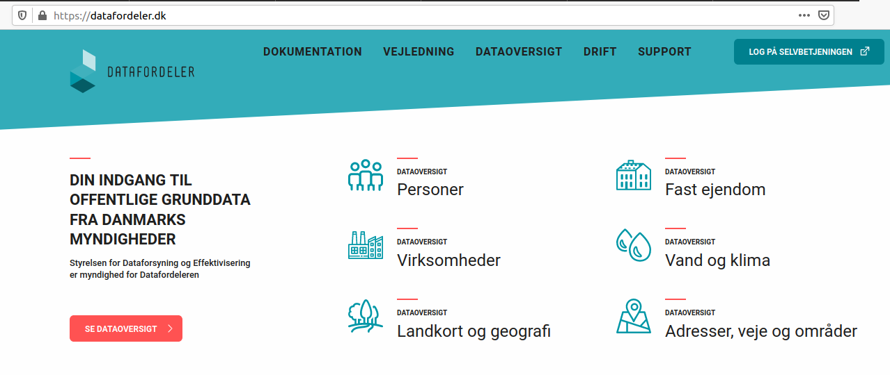
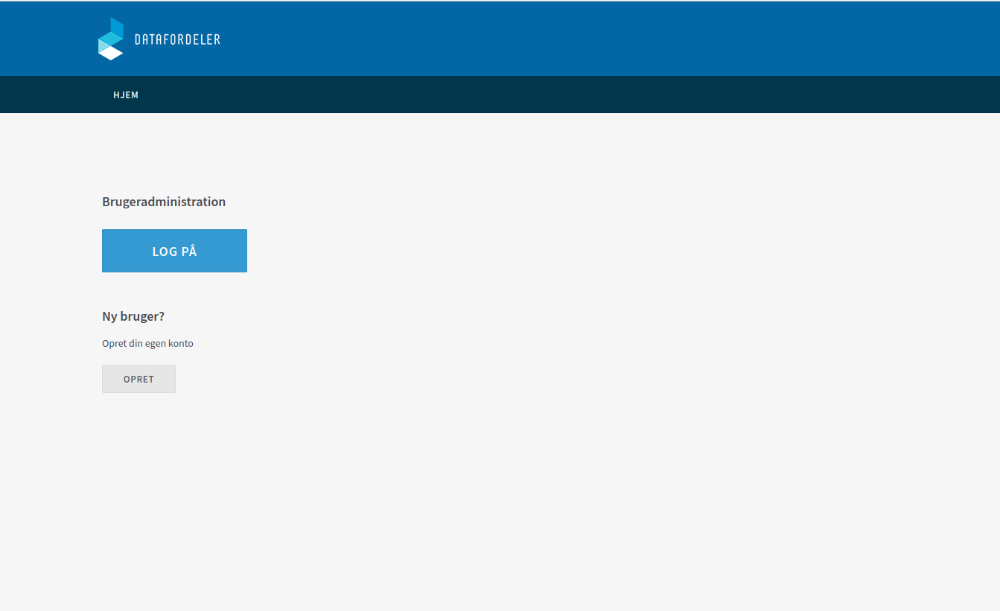
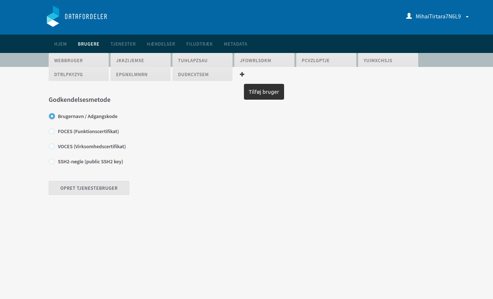
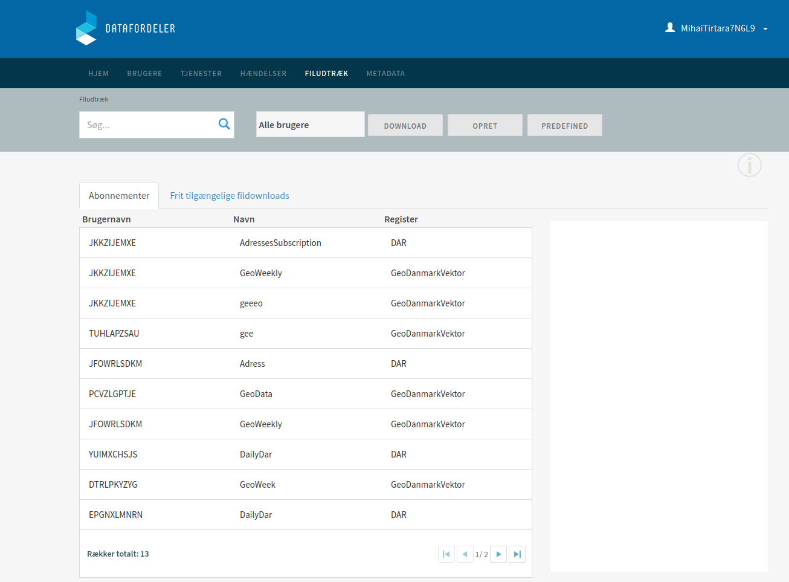
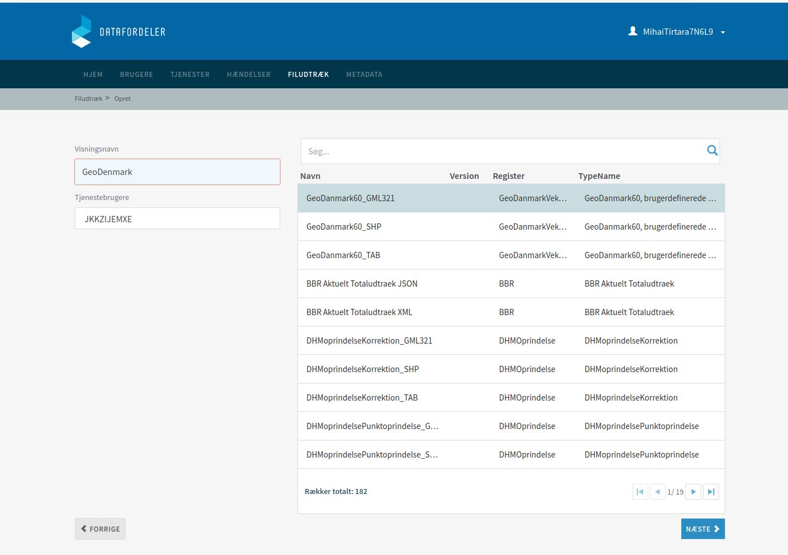

# Datafordelen
This is an event streaming application which retrieves the data from the Danish platform called Datafordeler and process the information using Kafka


## Requirements
* Docker
* Datafordeler, the system uses three of their registers:
1. DAR, which holds the latest data for the adresses in Denmark 
2. GeoDanmarkVektor which holds the geographical data of Denmark.
3. BBR, which holds information about buildings in Denmark.
<br>
Information on how to set up the registers can be found in the following section.

## Datafordeler
In order to have access to the data, first you have to go at the following link:https://datafordeler.dk/ and log in into Self-Service(Selvebetjeningen)

Afterwards you can create a new account or log in into the existing one

Inside the platform to be able to subscribe to a register, similarly you have to create an account or use an existing one.

Once you have completed the account creation in order to see your subscribed register or to add new ones, you have to acces the "Filudtraek" tab.

To subscribe to new register you can choose between the options: "Download","Opret","Predefined". Once you made a decision you'll be directed to a new page where you can choose the desired register.


## Configure environment variable
```
. ./dev/docker-compose.yml
```
## Building
```
docker build -t datafordeleren
```

## Running
```
docker-compose up
```
